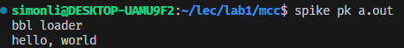

# LAB 1

## PART B

### Exercise 4

1. `-o`: 用户自定义输出的文件名称。
2. `-S`: 生成汇编文件。
3. `-c`: 编译代码并生成默认的输出文件`a.out`。
4. `-m`: 用户选择特定的体系结构。
5. `-v`: 编译过程中显示详细信息。

使用方法：

1. `gcc hello.c -o hello.out` / `mcc hello.c -o hello.out`
2. `gcc -S hello.c` / `mcc -S hello.c`
3. `gcc -c hello.c` / `mcc -c hello.c`
4. `gcc -march=x86-64 hello.c` / `mcc -mX64(-mRISCV) hello.c`
5. `gcc -v hello.c` / `mcc -v hello.c`

### Exercise 5

```c
    Exp_Add e = (Exp_Add) exp;
    compile_exp(e->left);
    emit("\tpush %rax\n");
    compile_exp(e->right);
    emit("\tpop %rbx\n");
    emit("\taddq %rbx, %rax\n");
    break;
```

先强制转换为加法表达式；再编译加法表达式的左操作数`a`，将`%rax`的值压入栈中，保存左子式的结果；再编译加法表达式的右操作数`5`，将栈顶的值弹出并存储到`%rbx`寄存器中，这是为了取出之前保存的左子式的结果；最后，将`%rbx`和`%rax`寄存器中的值相加，并将结果存储回`%rax`寄存器中，返回赋值给`a`。

```c
    Stm_Print s = (Stm_Print) stm;
    compile_exp(s->exp);
    emit("\tmovq %rax, %rsi\n");
    emit("\tleaq mcc_format(%rip), %rdi\n");
    emit("\tcall printf\n");
    break;
```

先将`stm`强制转化为`stm_print`类型变量；再通过`compile_exp`函数来编译打印语句的`s->exp`部分；然后通过`emit("\tmovq %rax, %rsi\n");`将`%rax`寄存器中的值转移到`%rsi`寄存器中，因为`printf`函数使用`%rdi`和`%rsi`寄存器来接收参数；然后将字符串`mcc_format`的地址传递给`%rdi`寄存器，这个字符串用作格式字符串；最后调用`printf`函数，将`%rsi`和`%rdi`中的参数传递给`printf`函数以进行打印操作。

### Exercise 6


